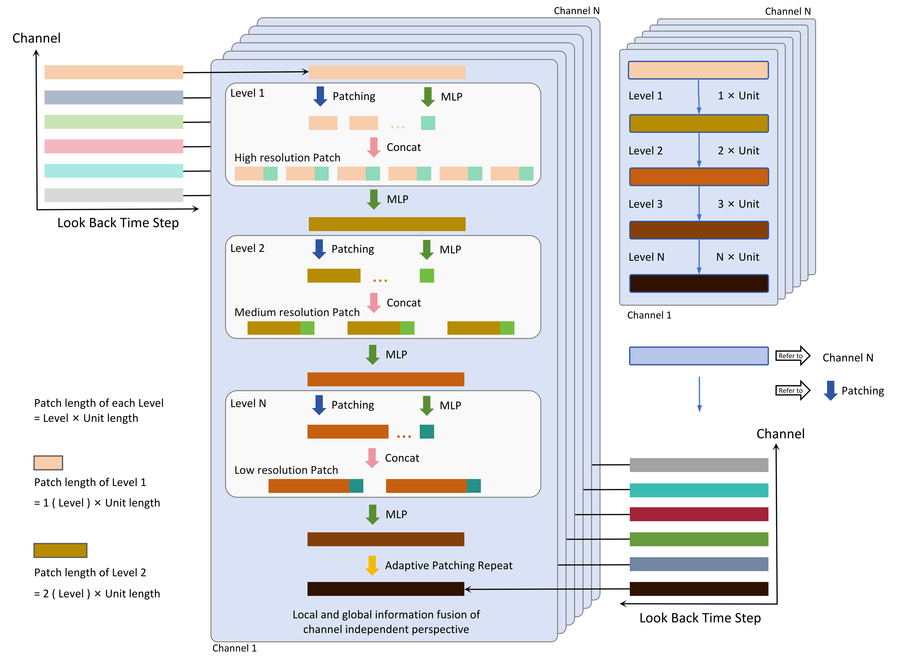
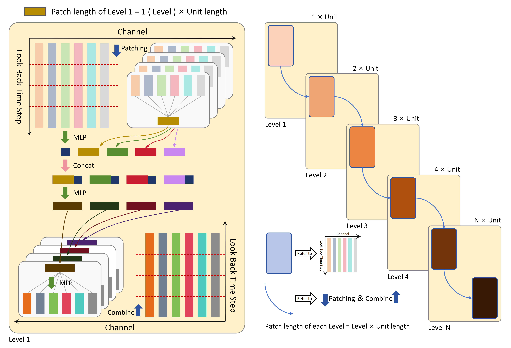

# FTP: A Fusion-Enriched Framework for Multi-Channel Time Series Prediction with Global-Local Information Fusion, Channel Enhancement, and Linear Integration

This repository contains the implementation of the paper **"FTP: A Fusion-Enriched Framework for Multi-Channel Time Series Prediction with Global-Local Information Fusion, Channel Enhancement, and Linear Integration"** using PyTorch. By leveraging a more sophisticated linear layer structure, FTP achieves significantly better prediction performance on several benchmark datasets compared to state-of-the-art methods, demonstrating its superior generalization ability and effectiveness.

## Main Module Components

### Global and Local Information Fusion Module

This module dynamically and adaptively extracts local information at different resolutions within the look-back window. It employs a hierarchical recursive strategy to fuse global and local information from both channel-independent and channel-mixing perspectives. This design effectively captures the intrinsic relationship between long-term dependencies and short-term dynamics while also identifying periodic factors, thereby greatly enhancing the model's feature representation capability.

#### Global and Local Information Fusion Module (Channel-Independent Perspective)

#### Global and Local Information Fusion Module (Channel-Mixing Perspective)

### Channel Enhancement Module

This module focuses on the most critical channel information at each time step and propagates it across all channels to strengthen the representation of anomalous or key features. By amplifying the influence of dominant channels, the model can more accurately capture critical characteristics in multi-channel data.

### Linear Integration Module

This module integrates the results of global-local information fusion from both channel-independent and channel-mixing perspectives, the enhanced channel information, and the raw sequence data. By synergistically combining the advantages of each module, it achieves efficient extraction and integration of complex features in multi-channel data.

## Performance Comparison

For the PEMS datasets, the prediction horizons T are 12, 24, 48, and 96, while for other datasets, T is set to 96, 192, 336, and 720. The look-back window L is fixed at 96 for all experiments. The table below presents the Mean Squared Error (MSE) and Mean Absolute Error (MAE) results for multivariate time series forecasting, where smaller values indicate higher prediction accuracy. The best results are highlighted in red, while the second-best results are marked in blue with underlining. Other results are sourced from iTransformer and SOFTS.

## Environment Requirements

python==3.10.14

torch==2.3.0+cu121

numpy==1.26.4

scikit-learn==1.5.1

pandas==2.2.2

## Dataset

You can download the required datasets for this model directly from [Google Drive](https://drive.google.com/drive/folders/1mR8pk5J6dZAmByptTZ1LBt4l2B-0I8oA?usp=sharing). Once the datasets are downloaded, please place the `dataset` folder in the FTP directory.

## Running the Code

To run the model, execute the scripts located in `./scripts/long_term_forecast/` from the FTP directory.

For example, to predict the Weather dataset using FTP, run the following command:

`sh ./scripts/long_term_forecast/Weather_script/Weather_FTP.sh`

## Acknowledgements

We would like to thank the following GitHub repositories for their valuable codebases or datasets, which contributed significantly to time series prediction tasks:

https://github.com/zhouhaoyi/Informer2020

https://github.com/thuml/Time-Series-Library

https://github.com/thuml/iTransformer

https://github.com/Secilia-Cxy/SOFTS

