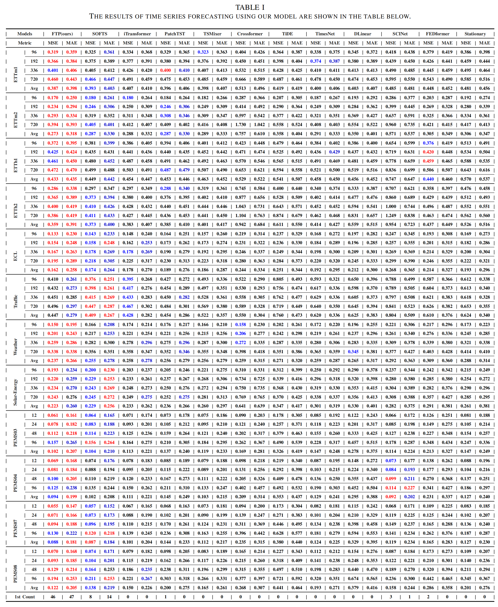

# FTP: A Fusion-Enriched Framework for Multi-Channel Time Series Prediction with Global-Local Information Fusion, Channel Enhancement, and Linear Integration

这个是论文"FTP: A Fusion-Enriched Framework for Multi-Channel Time Series Prediction with Global-Local Information Fusion, Channel Enhancement, and Linear Integration"通过Pytorch实现的代码仓库。FTP基于设计更加丰富的线性层结构，在多个基准数据集上的预测性能显著优于当前最先进的方法，验证了其卓越的通用性和优越性。

## 主要模块组成

### 全局与局部信息融合模块

该模块通过动态自适应的方法灵活控制回望窗口内不同分辨率下局部信息的提取，并采用层级递归策略，从通道独立和通道混合两种视角融合全局与局部信息，从而有效表征长期依赖趋势与短期动态变化之间的内在关系，同时捕捉周期性因素等特征。这显著增强了模型的特征表达能力。

#### 通道独立视角下的全局与局部信息融合模块

#### 通道混合视角下的全局与局部信息融合模块

### 通道增强模块

该模块聚焦每个时间步中最重要的通道信息，并将其扩展至所有通道，从而强化对异常特征或关键信息的表征能力。通过放大主导通道的作用，模型能够更准确地捕捉多通道数据中的关键特征。

### 线性层融合模块

此模块将通道独立和通道混合视角下的全局与局部信息融合结果，与通道增强信息以及原始序列信息有机整合，充分发挥各模块的优势，实现多通道数据复杂特征的高效提取与整合。

## 性能对比

对于PEMS数据集，我们预测的时间步范围T是12 24 48 96，对于其他数据集我们预测的时间步范围T是96 192 336 720，回望窗口L设置的都是96。下表为多元时间序列预测的MSE和MAE结果，其中值越小，预测的准确率就越好。最优结果用红色表示，次优结果用蓝色和下划线表示。其他结果取自iTransformer 和 SOFTS。

## 环境配置

python==3.10.14

torch==2.3.0+cu121

numpy==1.26.4

scikit-learn==1.5.1

pandas==2.2.2

## 数据集

你可以直接从[Google Drive](https://drive.google.com/drive/folders/1mR8pk5J6dZAmByptTZ1LBt4l2B-0I8oA?usp=sharing)下载本模型所需的数据集，当数据集下载完成后，请把`dataset`放到FTP目录下。

## 运行代码

为了运行模型的代码，你需要在FTP目录下运行`./scripts/long_term_forecast/`中的脚本。

例如，你想运行FTP对于Weather数据集的预测，请运行下列的命令：

`sh ./scripts/long_term_forecast/Weather_script/Weather_FTP.sh`

## 致谢

我们非常感谢以下GItHub代码仓库，因为它们有价值的代码库或数据集，为时间序列预测任务作出了贡献：

https://github.com/zhouhaoyi/Informer2020

https://github.com/thuml/Time-Series-Library

https://github.com/thuml/iTransformer

https://github.com/Secilia-Cxy/SOFTS

